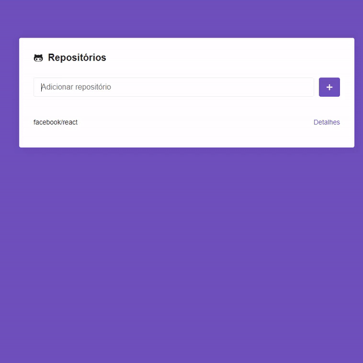

# Aplicativo feito com ReactJS e a API do Github.  
### Funcionalidades:

Acessar repositórios e suas issues, com categorização e paginação.

[Link para demo](https://festive-panini-93af81.netlify.app/)

## Demostração do app:

## Como rodar

Após clonar o repositório, rode:

### `yarn start`

Esse script roda o app em modo de desenvolvimento. 
Abra [http://localhost:3000](http://localhost:3000) Para o visualizar no navegador.
